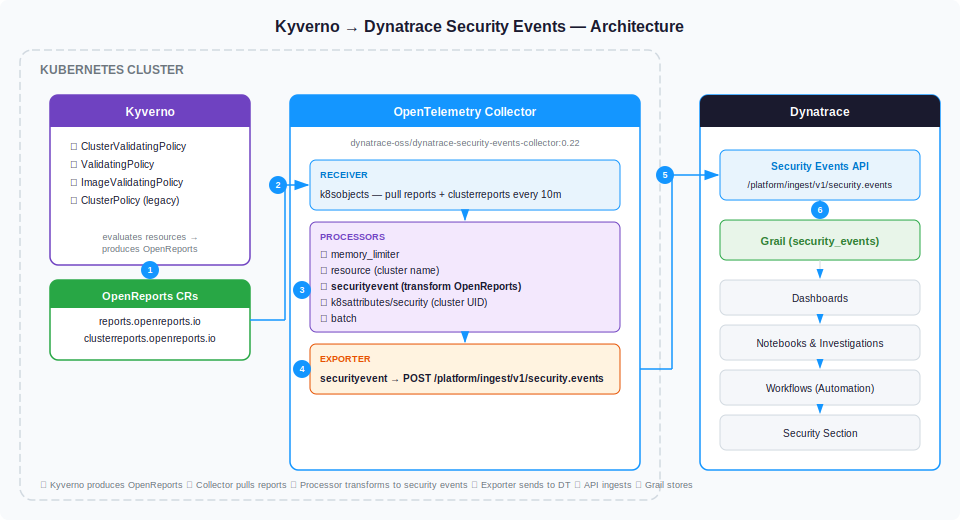

# How it works

## Architecture



| Step | Component | Description |
|------|-----------|-------------|
| **1** | **Kyverno evaluates policies** | Kyverno validates, mutates, and generates Kubernetes resources. For each validating policy, Kyverno produces OpenReports containing per-resource pass/fail results with severity and compliance details. |
| **2** | **Collector pulls OpenReports** | The `k8sobjects` receiver in the OpenTelemetry Collector periodically pulls `reports` and `clusterreports` from the `openreports.io` API group every 10 minutes. |
| **3** | **Security Event Processor transforms data** | The custom `securityevent` processor parses each OpenReport, extracts individual policy results, and maps them to the Dynatrace security event schema — assigning severity, risk score, compliance status, and Kubernetes context. |
| **4** | **Metadata enrichment** | The `k8sattributes` processor adds Kubernetes metadata (cluster UID, namespace) and the `resource` processor inserts the cluster name. |
| **5** | **Security Event Exporter delivers to Dynatrace** | The custom `securityevent` exporter sends batched HTTP POST requests to `/platform/ingest/v1/security.events`, authenticated with an API token. |
| **6** | **Grail stores and indexes events** | Dynatrace stores the security events in Grail. They become queryable in Notebooks, Investigations, and Dashboards. |

## Kyverno policy types that generate reports

Every policy deployed in the cluster generates a report for each targeted resource. The Security Event Processor collects those reports and sends each result status as a security event to Dynatrace.

### Policy types that produce OpenReports (and appear as security events)

| Policy type | API group | Scope | Report type |
|---|---|---|---|
| `ClusterPolicy` | `kyverno.io/v1` | Cluster-wide | `clusterreports` |
| `Policy` | `kyverno.io/v1` | Namespaced | `reports` |
| `ClusterValidatingPolicy` | `policies.kyverno.io/v1` | Cluster-wide | `clusterreports` |
| `ValidatingPolicy` | `policies.kyverno.io/v1` | Namespaced | `reports` |
| `ImageValidatingPolicy` | `policies.kyverno.io/v1` | Cluster-wide | `clusterreports` |
| `ClusterImageValidatingPolicy` | `policies.kyverno.io/v1` | Cluster-wide | `clusterreports` |
| `NamespacedImageValidatingPolicy` | `policies.kyverno.io/v1` | Namespaced | `reports` |

### Policy types that do NOT produce reports

| Policy type | Reason |
|---|---|
| `MutatingPolicy` / `ClusterMutatingPolicy` | Modifies resources; no pass/fail compliance result. |
| `GeneratingPolicy` / `ClusterGeneratingPolicy` | Creates resources; no compliance check. |
| `DeletingPolicy` / `ClusterDeletingPolicy` | Cron-based cleanup; no compliance check. |
| `CleanupPolicy` / `ClusterCleanupPolicy` | Legacy cleanup; no compliance report. |

## Security event field mapping

| OpenReport field | Dynatrace security event field | Value |
|---|---|---|
| `severity: critical` | `finding.severity` / `dt.security.risk.score` | `critical` / `10.0` |
| `severity: high` | `finding.severity` / `dt.security.risk.score` | `high` / `8.9` |
| `severity: medium` | `finding.severity` / `dt.security.risk.score` | `medium` / `6.9` |
| `severity: low` | `finding.severity` / `dt.security.risk.score` | `low` / `3.9` |
| `result: pass` | `compliance.status` | `PASSED` |
| `result: fail` | `compliance.status` | `FAILED` |
| `result: error / skip` | `compliance.status` | `NOT_RELEVANT` |
| `result` (raw value) | `finding.status` | `pass`, `fail`, `error`, `skip` |
| `policy` + `rule` | `finding.title` | `policy-name - rule-name` |
| `policy` | `finding.type` / `compliance.requirements` | Policy name |
| `rule` | `compliance.control` | Rule name |
| `result.source` | `product.vendor` / `product.name` / `event.provider` | Auto-detected (e.g. `kyverno`) |
| `scope.uid` | `object.id` | Kubernetes resource UID |
| `scope.kind` | `object.type` | e.g. `Pod`, `Deployment` |
| `scope.name` | `object.name` | Kubernetes resource name |
| Event name | `event.name` | `Compliance finding event` (fixed) |
| Event type | `event.type` | `COMPLIANCE_FINDING` (fixed) |
| Event category | `event.category` | `COMPLIANCE` (fixed) |
| Schema version | `event.version` | `1.309` (fixed) |

## Collector pipeline

The security events pipeline processes OpenReports through this chain:

```
k8sobjects receiver (pull every 10m)
    │
    ▼
memory_limiter (70% limit, 30% spike)
    │
    ▼
resource processor (insert k8s.cluster.name)
    │
    ▼
securityevent processor (transform OpenReports → security events)
    │
    ▼
k8sattributes/security (enrich with k8s.cluster.uid)
    │
    ▼
batch processor (800 batch size, 30s timeout)
    │
    ▼
securityevent exporter → POST /platform/ingest/v1/security.events
```
