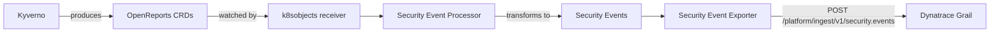

# Overview

In the following, you'll learn how to ingest policy compliance findings and security events from [Kyverno](https://kyverno.io/) into Grail and analyze them on the Dynatrace platform, so you can gain insights into Kubernetes policy compliance posture and easily work with your data.

## What is Kyverno?

[Kyverno](https://kyverno.io/) is a Kubernetes-native policy engine that validates, mutates, and generates resource configurations. Administrators define policies as Kubernetes resources — no new language to learn.

When policies are deployed in a cluster, Kyverno evaluates every targeted resource and produces **OpenReports** — standardized compliance reports (`reports` and `clusterreports` in the `openreports.io` API group) describing whether each resource passes or fails each policy rule.

## What gets ingested?

This integration collects those OpenReports and transforms each individual policy result into a **Dynatrace security event** with:

| Field | Description |
|---|---|
| **Category** | `COMPLIANCE` |
| **Severity** | `critical`, `high`, `medium`, or `low` — mapped from the Kyverno policy severity |
| **Risk score** | `10.0`, `8.9`, `6.9`, or `3.9` — corresponding to the severity |
| **Compliance status** | `PASSED` (pass), `FAILED` (fail), or `NOT_RELEVANT` (error, skip) |
| **Finding title** | `policy-name - rule-name` |
| **Event type** | `COMPLIANCE_FINDING` |
| **Product vendor** | Auto-detected from report source (e.g., `kyverno`) |
| **Description** | Varies by status: `"Policy violation on {resource}..."` (fail), `"Policy check passed on {resource}..."` (pass) |
| **Kubernetes context** | Cluster name, namespace, pod, workload kind, workload name, cluster UID |

## How it works at a high level

1. **Kyverno evaluates policies** against cluster resources and produces OpenReports.
2. **The OpenTelemetry Collector** watches for OpenReport CRs via the Kubernetes API.
3. **The Security Event Processor** transforms each report finding into a structured Dynatrace security event.
4. **The Security Event Exporter** delivers events to the Dynatrace Security Events Ingest API (`/platform/ingest/v1/security.events`).
5. **Dynatrace stores events in Grail** for querying, dashboards, and workflow automation.

## Components

| Component | Role | Source |
|-----------|------|--------|
| Security Event Processor | Transforms OpenReports into security events | [`src/SecurityLogEventProcessor`](https://github.com/dynatrace-oss/dynatrace-security-events-collector/tree/main/src/SecurityLogEventProcessor) |
| Security Event Exporter | Delivers events to Dynatrace API | [`src/SecurityEventExporter`](https://github.com/dynatrace-oss/dynatrace-security-events-collector/tree/main/src/SecurityEventExporter) |
| Collector image | Pre-built OTel Collector with both plugins | [`ghcr.io/dynatrace-oss/dynatrace-security-events-collector`](https://github.com/dynatrace-oss/dynatrace-security-events-collector/pkgs/container/dynatrace-security-events-collector) |
