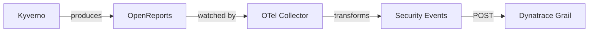

# Ingest Kyverno policy compliance findings and security events

Ingest Kubernetes policy compliance findings and security events from **Kyverno** into Grail and analyze them in Dynatrace.

---

## What this integration does

This integration collects [Kyverno OpenReports](https://github.com/kyverno/reports-server) — standardized compliance reports produced when Kyverno evaluates policies against cluster resources — and transforms each policy result into a **Dynatrace security event** with severity, compliance status, risk scoring, and full Kubernetes context.

Once ingested, the events are available for querying, dashboards, and workflow automation in Dynatrace.

## Get started

-   **[Overview](get-started/overview.md)**

    Learn what gets ingested, how the pipeline works, and what components are involved.

-   **[Use cases](get-started/use-cases.md)**

    Explore what you can do with the ingested compliance data in Dynatrace.

-   **[Requirements](get-started/requirements.md)**

    Prerequisites, RBAC configuration, and Dynatrace API token setup.

## Set up

- **[Activation and setup](activation-and-setup.md)** — Deploy the collector to your cluster step by step.

## Learn more

- **[How it works](details/how-it-works.md)** — Architecture, field mapping, policy types
- **[Collector configuration](details/collector-configuration.md)** — Complete attribute reference for receiver, processor, and exporter
- **[Pipeline examples](details/pipeline-examples.md)** — Ready-to-use configurations for different scenarios
- **[Build your own collector](details/build-your-own-collector.md)** — Custom builds with OCB

## Use your data

- **[Monitor data](monitor-data.md)** — Collector health metrics and pipeline monitoring
- **[Visualize and analyze findings](visualize-and-analyze.md)** — Dashboards and DQL queries
- **[Automate and orchestrate findings](automate-and-orchestrate.md)** — Workflows and alerting
- **[Query ingested data](query-ingested-data.md)** — DQL examples for compliance analysis

## Troubleshoot

- **[Troubleshooting](troubleshooting.md)** — Common issues and how to resolve them

## Manage

- **[Delete connections](delete-connections.md)** — Remove the integration from your cluster
